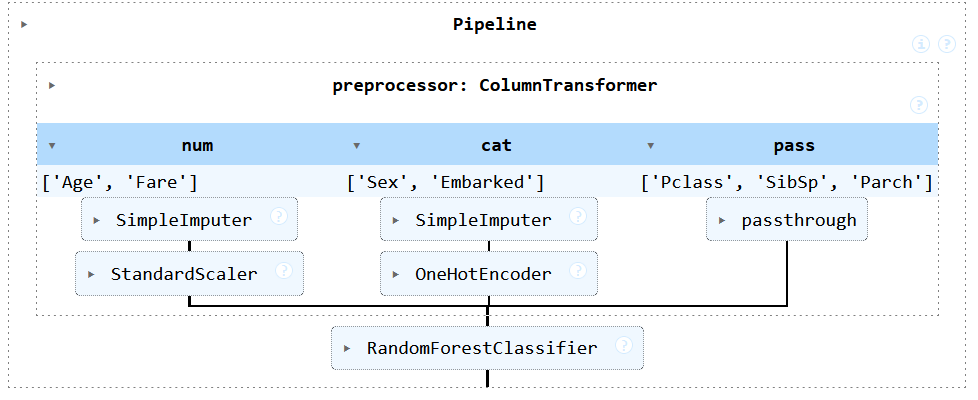

# Titanic ML API

This project is a simple API that predicts the survival of passengers on the Titanic. It uses a machine learning model that was trained on the Titanic dataset from Kaggle.

## Repository Structure

```
.
├── artifcats/
│   └── pipeline.pkl
├── notebooks/
│   ├── EDA.ipynb
│   └── ML.ipynb
├── scripts/
│   └── utils.py
└── serving/
    └── api.py
```

### Artifacts

The `artifacts` directory contains the serialized pipeline that was trained on the Titanic dataset.

### Notebooks

The `notebooks` directory contains the Jupyter notebooks that were used to explore the Titanic dataset and train the machine learning model.

### Scripts

The `scripts` directory contains utility functions that are used to preprocess the data and make predictions.

### Serving

The `serving` directory contains the API that serves the machine learning model.

## Usage

To run the API, execute the following command:

```bash
python serving/api.py
```

The API will be available at `http://localhost:8000`.

## Endpoints

`/predict` **POST**

**Request**

```json
{
  "PassengerId": 1,
  "Pclass": 1,
  "Name": "John Doe",
  "Sex": "female",
  "Age": 22,
  "SibSp": 0,
  "Parch": 0,
  "Ticket": "A/5 21171",
  "Fare": 22,
  "Cabin": null,
  "Embarked": "S"
}
```

**Response**

```json
{
  "Survived": 1
}
```

## Pipeline explanation 

The pipeline is composed of the following steps:
- **Feature Selection** : The features used in the model are `Pclass`, `Sex`, `Age`, `SibSp`, `Parch`, `Fare`, and `Embarked`.
- **Preprocessing**: The data is preprocessed by filling missing values and encoding categorical variables.
- **Model**: The model used is a Random Forest Classifier.
- **Prediction**: The model predicts the survival of passengers on the Titanic.

Here is a diagram of the pipeline:



## Titanic - Machine Learning from Disaster Kaggle Competition

A notebook and submission file for the Titanic Kaggle competition can be found in the `notebooks` and `data` directory.

## Future Works 

- [ ] Add an interface with Streamlit to interact with the API
- [ ] Add a Dockerfile to containerize the API
